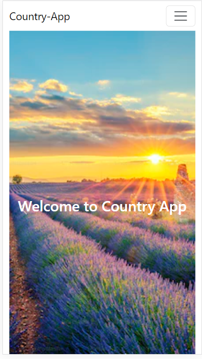

# Country App

Country app where you can find different informations about different countries. 
This app will give you assistance in case of finding any specific information of a country for example weather in Spain, popuation of England, flag of US. This app solely made for learning purpose of react and redux technology. 

## Technologies used

Built with: 

- HTML
- JS
- CSS
- Bootstrap
- Reactjs
- Redux
- Firebase 

## Setup and usage

Live page [here](https://country-project-60698.web.app/)

- User can search any country from country page
- Get current weather of any country by clicking it
- The favourite page will only work for logged in users
- Registered user will also have the access of add or delete favourite countries.

## Screenshot

## Authors and acknowledgment

SANI SAHA
- GitHub @sanisaha
- [LinkedIn](https://www.linkedin.com/in/sani-saha-28978aa4/)
